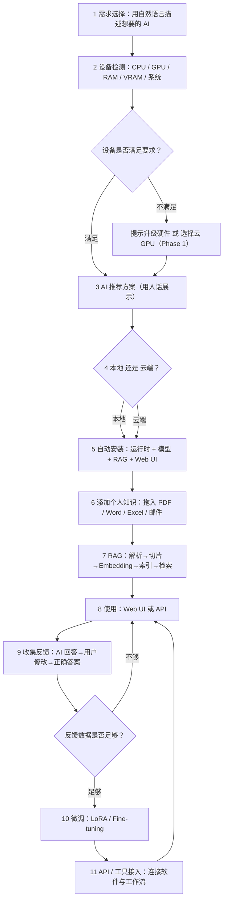
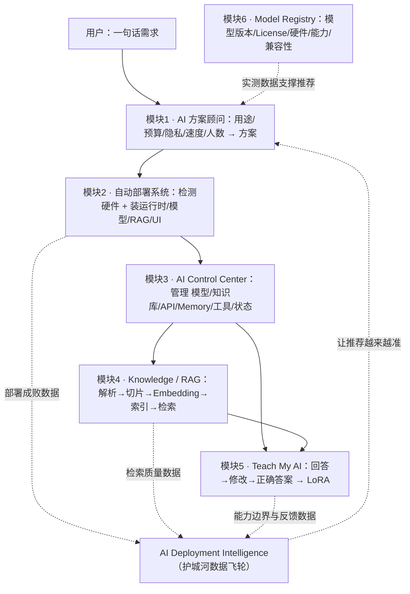
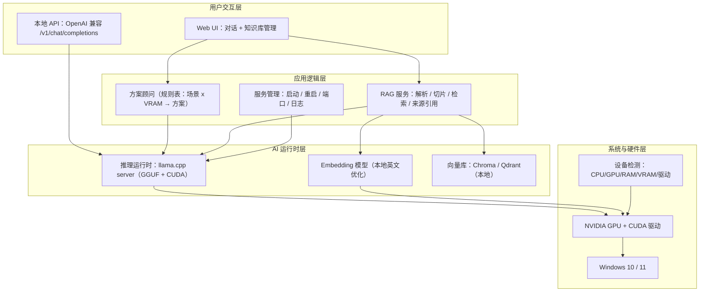
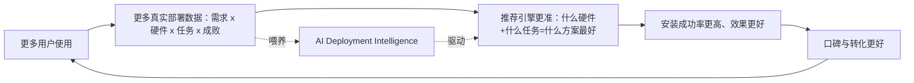
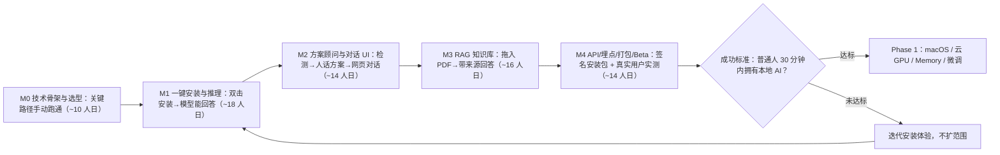

# 10 · Figma 图表(流程图与架构)

> 用 FigJam 绘制,链接为"认领并编辑"地址。首次点击会把图收进你的 Figma(michael.yan@purehd.com)。
> 图的 Mermaid 源码一并存档于此,方便版本管理与随时重生成。

## 图表清单

| # | 图 | 打开链接 |
|---|-----|----------|
| 01 | 端到端产品流程图 | https://www.figma.com/board/UhRRICw1kkxDgpa73JtXqE |
| 02 | 六大核心模块系统架构 | https://www.figma.com/board/b6Drqbqsr8lBytyapgdz5N |
| 03 | MVP 技术架构(Windows + NVIDIA) | https://www.figma.com/board/abmkQ5vIh5ZMY8sB078W0p |
| 04 | 护城河数据飞轮 | https://www.figma.com/board/pb1VyFWcQaFi27Y1lOpCnr |
| 05 | MVP 里程碑路线图(M0-M4) | https://www.figma.com/board/taWwx0iOYTFrkPS65RXpaU |

---

## 如何维护

- 修改图:直接在 FigJam 里拖拽/改字。
- 结构性大改:改下面的 Mermaid 源码,重新用工具生成一张新图(FigJam 内单个图形无法用工具批量重排)。
- 一张图对应一个 FigJam 文件。

---

## 源码存档

### 01 端到端产品流程图

### 02 六大核心模块系统架构

### 03 MVP 技术架构(Windows + NVIDIA)

### 04 护城河数据飞轮

### 05 MVP 里程碑路线图(M0-M4)

---

相关文档:[02 产品概览](02-product-overview.md) · [03 核心模块](03-core-modules.md) · [09 MVP 工程任务清单](09-mvp-engineering-tasks.md)
