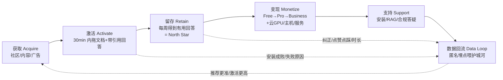

# 12 · 商业计划书(Business Plan)

> 面向投资人 / 早期运营者的一体化商业计划。
> 产品:**Build My AI**(repo: `AI-SET-UP-GROUP`)。
> 一句话:**把复杂的开源 AI 世界,变成普通人也能一键拥有的个人 AI。**
>
> ⚠️ 阅读约定:本文中所有市场规模、财务、转化率、成本数字均为**估算 / 假设**,用于判断量级和做决策,不是承诺。凡涉及数字处均已标注。

---

## 目录

1. [执行摘要](#1-执行摘要)
2. [问题与市场机会](#2-问题与市场机会)
3. [产品与解决方案](#3-产品与解决方案)
4. [目标客户与细分](#4-目标客户与细分)
5. [商业模式与单位经济](#5-商业模式与单位经济)
6. [竞争格局](#6-竞争格局)
7. [上市与增长策略(GTM)](#7-上市与增长策略gtm)
8. [运营流程](#8-运营流程)
9. [团队与分工](#9-团队与分工)
10. [里程碑与财务](#10-里程碑与财务)
11. [风险与应对](#11-风险与应对)
12. [资源需求(Bootstrap vs 融资)](#12-资源需求bootstrap-vs-融资)
13. [下一步 30 天要做的 5 件事](#13-下一步-30-天要做的-5-件事)

---

## 1. 执行摘要

### 1.1 电梯陈述

**Build My AI** 是面向**非技术用户**的个人 AI 一键搭建平台。今天,想拥有一个私有、本地、懂自己资料的 AI,用户必须理解模型选型、GPU/VRAM、CUDA、Docker、RAG、微调——这是普通人翻不过去的墙。我们把这一切藏在一个问题后面:"**我想让 AI 帮我做什么?**"

用户只需:选需求 → 我们检测硬件(CPU/GPU/RAM/VRAM)→ AI 顾问推荐开源模型与方案 → 一键本地安装 → 拖入 PDF/Word/Excel 做 RAG → 得到**带来源引用**的回答。数据默认**不出设备**,隐私就是产品。

我们真正积累的资产不是安装器,而是 **AI Deployment Intelligence**——"什么用户 + 什么任务 + 什么数据 + 什么预算 + 什么硬件 = 什么部署方案效果最好"的实测数据飞轮(见 [06 护城河](06-moat.md))。每一次免费部署都在喂养这个别人拿不到的数据集。

### 1.2 现阶段:要什么 / 做什么

| 维度 | 现状与主张 |
|------|-----------|
| **阶段** | Pre-seed / MVP 验证期(Phase 0,见 [07 路线图](07-roadmap.md)) |
| **要证明的假设** | "普通人能在 30 分钟内拥有一个能用、懂自己资料的本地 AI" |
| **MVP 范围** | Windows + NVIDIA GPU,美国市场,本地优先,隐私=数据不出设备(见 [04 MVP 范围](04-mvp.md)) |
| **现在要什么** | (a) 10~20 个真实非技术用户完成激活;(b) 埋点跑通、开始积累部署数据;(c) 决定 bootstrap 还是融 pre-seed |
| **现在做什么** | 打磨一键安装 + RAG 带来源引用这一条主链路,不扩范围 |
| **North Star** | **Weekly Answered Users** —— 每周从自己私有 AI 得到有用(带来源)回答的活跃用户数 |

**融资立场**:我们建议**先 bootstrap 到 MVP 验证通过**(激活率与留存出正信号),再谈 pre-seed。理由见 [第 12 节](#12-资源需求bootstrap-vs-融资)。若要融资,规模为 pre-seed **US$500K–$1.2M(估算)**,用途集中在工程与 GTM 的前 12–18 个月。

---

## 2. 问题与市场机会

### 2.1 为什么是现在(Why now)

三条曲线在 2024–2026 交汇,构成时间窗口:

1. **开源模型追平"够用"线**:Llama 3.1、Qwen2.5 等 8B–32B 量化模型,在文档问答 / 摘要 / 抽取这类高频办公任务上已"够好用",不再必须依赖 GPT-4 级云端模型。
2. **消费级硬件能跑**:GGUF 量化 + `llama.cpp` 让一张 8–16GB 显存的 NVIDIA 消费卡就能本地推理,门槛从"数据中心"降到"一台游戏本"。
3. **隐私与合规焦虑上升**:美国中小企业与专业人士(律师、会计、医疗、顾问)对"把客户资料贴进 ChatGPT"越来越警惕;CCPA/CPRA 等法规抬高了数据外流的代价。

**缺口**:能跑 ≠ 会装。工具(Ollama、LM Studio 等)全部默认用户是技术人。没人为"完全不懂 GPU 的老板"把这条链路做成一键。**这就是我们的位置。**

### 2.2 市场规模粗估(TAM / SAM / SOM)

> 全部为**自上而下 + 自下而上交叉验证的量级估算**,标注为估算。目的是判断"这事够不够大",不是精算。

**估算逻辑(自下而上,按 ICP 账户数 × ARPU):**

| 层级 | 定义 | 估算口径 | 规模(估算) |
|------|------|---------|------------|
| **TAM** | 全球所有"想要私有/本地 AI、有隐私敏感文档"的个人与中小企业 | 全球知识工作者中隐私敏感子集 × 平均年付费潜力 | **US$ 数百亿量级 / 年** |
| **SAM** | 美国市场、拥有 Windows+NVIDIA 设备、隐私敏感的中小企业主 / 专业人士 / 研究者 | 见下方拆解 | **US$ 20–40 亿 / 年(估算)** |
| **SOM(3 年可及)** | 我们前 3 年现实能触达并转化的部分 | SAM 的 0.5%–2% | **US$ 1,000 万–5,000 万 / 年 ARR(估算,乐观上限)** |

**SAM 自下而上拆解(估算):**

- 美国 ~3,300 万家小企业(SBA 口径,数量级)。取"信息/专业服务且数据敏感"子集,保守按 **3–5%** ≈ **100 万–165 万个目标账户**。
- 叠加独立专业人士(律师、会计、独立顾问)与研究者个人,合计目标可付费实体量级 **~150 万–250 万(估算)**。
- 假设混合 ARPU(Pro 与 Business 加权)**US$ 40–70 / 用户 / 月 → US$ 500–840 / 年(估算)**。
- SAM ≈ 200 万 × US$ ~700/年 ≈ **US$ 14 亿/年**,取区间给 **US$ 20–40 亿/年(估算,含设备/服务收入线上浮)**。

**结论(量级)**:即便 SOM 只做到 SAM 的 **1%**,也是 **千万级美元 ARR** 的生意;这足以支撑一家风险投资可回报的公司,同时又是一个"专注细分、可 bootstrap 起步"的市场。关键变量是**激活率**与**Free→Pro 转化率**(见 [第 5 节](#5-商业模式与单位经济) 与 [第 10 节](#10-里程碑与财务))。

---

## 3. 产品与解决方案

### 3.1 产品是什么

一个把"部署一个私有 AI"压缩成一条可视化流水线的桌面 + Web 平台:

```
需求选择  →  检测硬件         →  AI 顾问推荐        →  一键安装 / 云端手册
(选场景)   (CPU/GPU/RAM/VRAM)   (开源模型+RAG方案)     (本地优先)
   │                                                        │
   └────────────────────────────────────────────────────────┘
                              ↓
   拖入 PDF/Word/Excel  →  本地 RAG  →  对话带来源引用  →  Teach My AI 收反馈 → 以后微调
```

### 3.2 关键设计原则

- **本地优先,隐私=数据不出设备**:用户文档默认永不上云。
- **两个 AI 分开(重要)**:方案顾问大脑(安装时跑一次,可上云)与用户最终用的 AI(高频、默认本地)是两回事,隐私边界不同。详见 [11 AI 架构与模型路由](11-ai-architecture-and-model-routing.md)。
- **顾问绝不接触用户文档**:顾问只读"需求描述",红线是文档内容任何情况下不随顾问上云。

### 3.3 MVP 技术选型(示例)

| 组件 | 选型示例 |
|------|---------|
| 部署模型 | Llama 3.1 8B / Qwen2.5 14B/32B(GGUF,`llama.cpp`) |
| Embedding | `bge-base-en`(英文向量) |
| 向量库 | 本地向量库(Chroma / Qdrant 候选,见 [08 资源](08-resources.md)) |
| 方案顾问大脑 | 云端 Claude API(Haiku 意图分类,Opus/Sonnet 推理);MVP 可先用规则表 `(场景, VRAM 档位) → 方案` |
| 平台范围 | Windows + NVIDIA GPU |

### 3.4 文档与资产交叉链接

| 主题 | 文档 / 资产 |
|------|------------|
| 愿景与定位 | [01 愿景](01-vision.md) |
| 产品概览 | [02 产品概览](02-product-overview.md) |
| 核心模块 | [03 核心模块](03-core-modules.md) |
| MVP 范围与成功标准 | [04 MVP 范围](04-mvp.md) |
| 商业模式 | [05 商业模式](05-business-model.md) |
| 护城河 | [06 护城河](06-moat.md) |
| 路线图 | [07 路线图](07-roadmap.md) |
| 资源与链接(美国生态) | [08 资源](08-resources.md) |
| MVP 工程任务清单 | [09 工程任务清单](09-mvp-engineering-tasks.md) |
| 流程图与架构图 | [10 Figma 图表](10-figma-diagrams.md) |
| AI 架构与模型路由 | [11 AI 架构与模型路由](11-ai-architecture-and-model-routing.md) |
| 营销打法(待建) | [15 营销 Playbook](15-marketing-playbook.md) |
| 本地 AI 接入网页(演示聊天页 ↔ 本机模型) | [16 本地 AI 接入网页](16-local-ai-web-integration.md) |
| 可运行网站 | [`frontend/index.html`](../frontend/index.html) · [`frontend/build.html`](../frontend/build.html) · [`frontend/chat.html`](../frontend/chat.html)(可选接入本机模型,见 [16](16-local-ai-web-integration.md)) · [`frontend/dashboard.html`](../frontend/dashboard.html) · [`frontend/signup.html`](../frontend/signup.html) |
| 设计原型 | [`figma/prototype.html`](../figma/prototype.html) · [`figma/design-system.md`](../figma/design-system.md) |

---

## 4. 目标客户与细分

### 4.1 主 ICP(理想客户画像)

美国的**中小企业主 / 专业人士(律师、会计、顾问)、研究者**,共同特征:

- 有**隐私敏感文档**(合同、财务、病历、客户资料、未发表研究)。
- 拥有 **Windows + NVIDIA** 电脑。
- **不愿把资料上传云端**(合规、职业操守、竞争顾虑)。
- 对 AI 有需求但**不懂技术**,也不想学 GPU/CUDA/Docker。

### 4.2 细分优先级、痛点与付费意愿

| 细分 | 典型场景 | 核心痛点 | 付费意愿(估算) | 优先级 |
|------|---------|---------|----------------|--------|
| **专业服务个体 / 小所**(律师、会计、独立顾问) | 合同/税务/案卷问答、起草、检索 | 数据外流=职业风险;云 AI 不敢用 | 高(Pro US$29 无痛,愿升 Business) | **P0** |
| **隐私敏感中小企业主** | 公司知识库、SOP、采购、客服资料 | 想要"公司大脑"又怕上云;没 IT | 中高(Business US$299+ 起) | **P0** |
| **研究者 / 学术** | 论文库问答、笔记、数据抽取 | 未发表数据不能上云;预算有限 | 中(Pro 为主) | **P1** |
| **技术爱好者 / 开发者** | 自己折腾本地模型 | 其实会用 Ollama,不是我们核心 | 低(易流失到工具) | **P2(不投入获客)** |

**判断**:先集中 **P0 的专业服务个体**——痛点最尖锐(合规刚需)、决策链最短(个人即买家)、Pro US$29 客单低到无需审批。中小企业是**客单价放大器**,同一套技术卖权限/审计/集中管理。

---

## 5. 商业模式与单位经济

### 5.1 定价与套餐

| 套餐 | 价格 | 门槛 | 目标人群 |
|------|------|------|---------|
| **Free** | US$0 | **免注册**,收集匿名使用数据 | 获客 + 喂护城河数据 |
| **Pro** | **US$29/月** | 需创建免费账号 | 重度个人、专业人士、研究者 |
| **Business** | **从 US$299/月起** | 需账号 + 填公司名 | 中小企业(权限/审计/多用户) |

> **Beta 期间全部免费**。Pro/Business 功能开放但不收费,目的是最大化激活与数据积累;付费开关在验证后打开。套餐能力细节见 [05 商业模式](05-business-model.md)。

### 5.2 四条收入线

| 收入线 | 说明 | 毛利特征 |
|--------|------|---------|
| **① 订阅** | Free / Pro / Business | 高毛利(软件) |
| **② 云 GPU 抽成** | 设备不够的用户用云端算力,平台抽成(Phase 1) | 中毛利(转售算力 + 加价) |
| **③ 本地 AI 主机** | 预装平台的整机,面向"想要但没设备" | 低毛利但拉高 LTV、降门槛 |
| **④ 企业部署 / 技术服务** | 私有化部署项目制 + 数据整理/定制微调 | 高毛利、非线性、现金流早 |

### 5.3 关键成本洞察:顾问用云 API vs 自建 GPU

这是商业模式里最反直觉、也最省钱的一点(详见 [11 AI 架构与模型路由](11-ai-architecture-and-model-routing.md)):

| 用途 | 方案 | 成本(估算) |
|------|------|------------|
| **方案顾问大脑**(安装时跑一次,读需求不读文档) | 云端 Claude API(Haiku 分类 + 少量 Opus/Sonnet 推理) | **每用户约几美分**(one-shot) |
| 若错误地自建 GPU 来跑顾问 | 常驻 GPU 实例 | **约 US$145–540 / 月**(单实例,估算) |

**结论**:顾问大脑**必须用云 API**——它调用稀疏(每用户一次)、不碰隐私、按次几分钱;自建常驻 GPU 是纯浪费。而**用户最终用的 AI 必须默认本地**——它高频、碰隐私、本地边际成本≈0。**把这两个 AI 的部署位置搞反,就是把成本结构做反。**

### 5.4 单位经济:LTV / CAC 框架(假设)

> 以下为**假设值**,用于建立框架和敏感性直觉,不是实测。

**每用户平台成本(估算):**

- Free 用户:顾问 API ~几美分/次安装 + 埋点存储 ~趋近于 0 → **接近零边际成本**(本地推理由用户硬件承担)。
- Pro 用户:同上 + 更新/备份等云端功能,**估算 < US$1–3 / 月**。

**LTV / CAC 玩具模型(Pro,假设):**

| 变量 | 假设值 | 说明 |
|------|--------|------|
| ARPU(Pro) | US$29/月 | 定价 |
| 平台服务成本 | US$2/月 | 见上,估算 |
| 毛利率 | ~93% | (29−2)/29 |
| 月流失率 | 4%(假设) | → 平均生命周期 ~25 个月 |
| **LTV(毛利口径)** | 27 × 25 ≈ **US$675(估算)** | ARPU−成本 × 生命周期 |
| 目标 CAC | ≤ US$135 | 使 **LTV:CAC ≥ 5:1** |
| Payback | ~5 个月 | CAC / 月毛利 |

**Business(假设):**ARPU ≥ US$299/月,服务成本占比更高(支持/部署),按 US$60/月成本、月流失 2%(假设)→ 生命周期 ~50 月 → **LTV ≈ US$12,000(估算)**;可承受显著更高 CAC(直销 + 服务)。

**风险敏感点**:整个模型对 **Free→Pro 转化率** 和 **月流失率** 极度敏感,这两个数只能靠 MVP/Beta 实测。护城河数据的价值在于:随着推荐更准、激活率上升,CAC 下降、留存上升,单位经济持续改善(飞轮,见 [06 护城河](06-moat.md))。

---

## 6. 竞争格局

### 6.1 我们和谁在同一个货架

- **本地 AI 工具**:Ollama、LM Studio、Msty、GPT4All —— 都能在本地跑开源模型,但**默认用户是技术人**。
- **云端 AI**:ChatGPT / Claude.ai / Gemini —— 强大、零门槛,但**数据要上云**,隐私敏感场景不能用。

### 6.2 对比表

| 维度 | **Build My AI** | Ollama | LM Studio | Msty | GPT4All | ChatGPT / 云端 |
|------|:--:|:--:|:--:|:--:|:--:|:--:|
| 目标用户 | **非技术用户** | 开发者 / CLI | 技术玩家 | 进阶用户 | 进阶用户 | 所有人 |
| 硬件检测 + 方案推荐 | **✅ 一键、自动** | ❌ | ⚠️ 部分 | ⚠️ 部分 | ❌ | 不适用 |
| 一键安装(隐藏 GPU/CUDA) | **✅** | ⚠️ 命令行 | ⚠️ | ⚠️ | ⚠️ | 不适用 |
| RAG(拖文档 + **来源引用**) | **✅ 开箱、带引用** | ❌(需自搭) | ⚠️ 基础 | ✅ | ⚠️ | ✅(但上云) |
| 本地 / 隐私(数据不出设备) | **✅ 默认本地** | ✅ | ✅ | ✅ | ✅ | ❌ |
| 反馈→微调(Teach My AI) | **✅ 路线内** | ❌ | ❌ | ❌ | ❌ | ⚠️ 黑盒 |
| **部署智能数据飞轮** | **✅ 独有护城河** | ❌ | ❌ | ❌ | ❌ | ❌ |
| 企业(权限/审计/多用户) | **✅ Business** | ❌ | ❌ | ⚠️ | ❌ | ✅ 企业版 |

> 图例:✅ 有 / 强 · ⚠️ 部分 / 需自行搭建 · ❌ 无。评估为**主观定位判断(估算)**。

### 6.3 差异化一句话

> 别人给**技术人**一个**能跑模型的工具**;我们给**不懂技术的老板/专业人士**一个**一键拥有、懂自己资料、数据不出设备的私有 AI**——并且我们有**部署智能数据飞轮**,别人只能抄 UI,抄不走数据。

**为什么 Ollama 封个 GUI 打不垮我们**:UI 可以抄,安装器谁都能做;抄不走的是"几万次真实部署"里"什么硬件+什么任务=什么方案最好"的实测映射(见 [06 护城河](06-moat.md))。新模型发布时,对手看 benchmark 猜,我们知道它在 8GB 显存的英文合同问答里到底行不行。

---

## 7. 上市与增长策略(GTM)

> 完整战术见 [15 营销 Playbook](15-marketing-playbook.md)(待建)。这里给分阶段主线。

### 7.1 增长引擎:North Star 对齐

一切增长动作都对齐 **Weekly Answered Users**——每周从自己私有 AI 得到带来源回答的活跃用户。不是下载量,不是注册数,是**真正用起来、得到有用回答**的人。

**激活定义(北极星的入口)**:新用户在**首次会话 30 分钟内,拖入 ≥1 个文档并得到一个带来源引用的正确回答**。GTM 的每一分钱都是为了把人推过这条激活线。

### 7.2 分阶段 GTM

| 阶段 | 时间(估算) | 主渠道 | 目标 | 成功信号 |
|------|:--:|------|------|---------|
| **① 社区先行** | 第 0–3 月 | Reddit(r/LocalLLaMA、r/smallbusiness、r/lawyertalk 等)、Hacker News、专业人士社群、Discord | 找到 10–20 个真实非技术种子用户,拿激活/留存信号 | 激活率、口碑、bug 收敛 |
| **② 内容 / 教程** | 第 2–9 月 | YouTube 教程("给律师的私有 Aning,不上云")、SEO 博客、案例、比较页("Build My AI vs Ollama") | 用"隐私+一键"关键词做自然流量,建立信任 | 自然搜索流量、注册转化 |
| **③ 付费渠道** | 第 6 月起 | Google/Bing 搜索广告、YouTube 广告、行业 newsletter 赞助 | 在单位经济验证后放量,LTV:CAC≥5 才扩 | CAC、Payback、Free→Pro 转化 |

**广告 / 关键词示例(English, US market):**

- 高意图关键词:`private AI for lawyers`、`local ChatGPT for my documents`、`run AI on my own computer`、`offline AI for confidential files`、`self hosted AI no cloud`、`AI that reads my PDFs privately`。
- 长尾/合规:`HIPAA compliant local AI`、`CCPA private AI for small business`、`AI without sending data to cloud`。
- 比较页(SEO):`Build My AI vs Ollama`、`LM Studio alternative for non-technical users`。

### 7.3 渠道优先级判断

先做**内容 + 社区(近乎零 CAC)**,把激活链路和信任打磨到位;**付费广告等到 LTV:CAC 与 Payback 被 Beta 数据验证后再开闸**。过早买量 = 把漏水的桶灌满。

---

## 8. 运营流程

### 8.1 端到端业务流程



### 8.2 每个环节的关键动作与指标

| 环节 | 关键动作 | 主指标(估算目标见 [第 10 节](#10-里程碑与财务)) |
|------|---------|------|
| **获取** | 社区种子 → 内容 → 付费 | 注册数、CAC、渠道来源 |
| **激活** | 引导用户 30min 内完成"拖文档→带引用回答" | **激活率**(北极星入口) |
| **留存** | Memory、更新、稳定性,让用户每周回来问 | **Weekly Answered Users**、周留存 |
| **变现** | 在"离不开"之后设付费点(知识库/微调/API/企业权限) | Free→Pro 转化率、ARPU、扩张收入 |
| **支持** | 安装失败自愈、RAG 调优、合规问答 | 工单率、首答时间、安装成功率 |
| **数据回流** | 匿名埋点:需求/硬件/方案/成败/质量信号 | 数据覆盖度 → 推荐准确率提升 |

### 8.3 护城河的埋点红线

数据回流从 MVP 第一天起就做,但**红线明确**(见 [06 护城河](06-moat.md) 与 [11 AI 架构](11-ai-architecture-and-model-routing.md)):埋点只收集**硬件档位 / 方案 / 成败 / 质量信号**,**绝不含任何文档内容**;匿名、可关闭。数据结构的设计优先级等同于产品功能本身。

---

## 9. 团队与分工

### 9.1 早期(MVP,精简)必需角色

| 角色 | 职责 | MVP 阶段配置 |
|------|------|------------|
| **创始人 / 产品**(CEO) | 愿景、ICP 访谈、GTM、融资、优先级 | 创始人 |
| **全栈 / 桌面工程** | Windows 安装器、设备检测、`llama.cpp` 集成、Web UI | 1–2 人(核心) |
| **AI / RAG 工程** | RAG 管线、来源引用、Embedding、顾问路由、埋点 | 可与上合并或 +1 |
| **DevRel / 内容 / 社区** | 教程、社区、种子用户、案例 | 创始人兼任 → 第 6 月专职 |

**MVP 现实配置(估算)**:**2–3 人**即可跑通 Phase 0(1 名产品创始人 + 1–2 名工程),内容/社区由创始人兼任。

### 9.2 扩张期(Phase 1+)增补

| 角色 | 何时加入 | 为什么 |
|------|---------|--------|
| 云 / 基础设施工程 | 云 GPU 上线时 | 抽成收入线、云端可选 |
| 增长 / 付费投放 | 单位经济验证后 | 放量买量 |
| 企业销售 / 客户成功 | Business 起量时 | 客单价放大、私有化交付 |
| 合规 / 法务(可外包) | 企业客户要求时 | SOC 2 路线、License 审核、CCPA/CPRA |

---

## 10. 里程碑与财务

### 10.1 12–18 个月里程碑

> 时间为相对阶段,非承诺日期;推进以上一阶段验证为前提(见 [07 路线图](07-roadmap.md))。

| 时间(估算) | 里程碑 | 通过标准(门槛) |
|:--:|------|------|
| **M0–M3** | MVP 上线:Win+NVIDIA 一键装 + RAG 带引用 + 埋点 | 10–20 真实非技术用户;**激活率 ≥ 40%(假设目标)** |
| **M3–M6** | 验证留存与转化;开始内容 GTM | 周留存出正信号;Beta 用户口碑可复制 |
| **M6–M9** | 打开 Pro 付费;macOS 立项;云 GPU 原型 | **Free→Pro ≥ 3%(假设目标)**;首批付费 |
| **M9–M12** | 云 GPU 上线(收入线②);付费广告在 LTV:CAC≥5 时放量 | 单位经济为正;CAC/Payback 达标 |
| **M12–M18** | Business 层(权限/审计/多用户);首批企业部署(收入线④);本地 AI 主机试点(③) | 首批 Business 合同;ARR 达中性情景 |

### 10.2 三情景财务粗模型(12–18 个月,假设)

> ⚠️ **全部为假设**,用于压力测试而非预测。核心可变假设:**注册数、Free→Pro 转化率、ARPU、月流失、成本**。ARR 以第 18 个月月末运行率年化(估算)。

**共同假设(基准):**

| 假设项 | 值 | 备注 |
|------|----|----|
| Pro 价格 | US$29/月 | 定价 |
| Business 价格 | US$299/月(起) | 定价,取入门价建模 |
| Pro 平台成本 | US$2/用户/月 | 见 [5.4](#54-单位经济ltv--cac-框架假设) |
| Beta 免费期 | 前 3–6 月不收费 | 影响收入起点 |

**三情景关键假设与结果(第 18 月运行率,估算):**

| 参数 | 保守 | 中性 | 乐观 |
|------|:--:|:--:|:--:|
| 累计注册(Free) | 5,000 | 20,000 | 60,000 |
| Free→Pro 转化率 | 2% | 3.5% | 6% |
| Pro 付费用户数 | 100 | 700 | 3,600 |
| Business 客户数 | 2 | 12 | 40 |
| 月流失(Pro) | 6% | 4% | 3% |
| Pro 月收入 | US$2,900 | US$20,300 | US$104,400 |
| Business 月收入 | US$598 | US$3,588 | US$11,960 |
| 云 GPU + 服务(收入②④) | ~US$0 | ~US$3,000 | ~US$15,000 |
| **月运行率(合计)** | **~US$3,500** | **~US$27,000** | **~US$131,000** |
| **年化 ARR(估算)** | **~US$42K** | **~US$324K** | **~US$1.57M** |

**成本侧(简化,估算):**

| 项 | 保守 | 中性 | 乐观 |
|----|:--:|:--:|:--:|
| 团队(2–3 → 4–6 人) | 主要靠工资/股权 | 中 | 高 |
| 云 API(顾问)+基础设施 | 极低(每用户几分钱) | 低 | 中 |
| 获客(内容为主→付费) | 近零 | 中 | 高(放量) |

**结论**:保守情景下这是一个**能靠服务/企业收入线维持、靠社区慢增长**的 bootstrap 生意;中性情景达到**可融 seed 的 ARR 与增长斜率**;乐观情景验证了"千万级 ARR 可及"的量级(呼应 [第 2 节](#2-问题与市场机会) SOM)。**决定命运的两个数是转化率与流失率,只能靠 Beta 实测。**

---

## 11. 风险与应对

| 类别 | 风险 | 影响 | 应对 |
|------|------|------|------|
| **技术** | 一键安装在千奇百怪的 Windows+驱动组合上失败 | 直接砸激活率 | 收窄 MVP 到 NVIDIA;安装失败自动上报(喂兼容性地图);内置驱动/CUDA 检测与引导;失败自愈脚本 |
| **技术** | 8B–32B 本地模型在某些任务上"不够聪明" | 用户失望流失 | 用部署智能只推荐**在该任务实测行**的方案;云端可选作为出路;Teach My AI 逐步改善 |
| **法律 / License** | 开源模型 License 不允许商用/再分发(Llama 社区协议 vs Apache/MIT 各异) | 上架即侵权风险 | 每个上架模型**必须核对 License**(见 [08 资源](08-resources.md));只分发允许商用的;建 License 白名单 |
| **隐私 / 合规** | 美国 CCPA/CPRA 等州法;企业要求数据不出境 | 阻碍企业成交 | "数据不出设备"是天然合规优势;匿名埋点 + 可关闭 + 不含文档内容;Business 走 SOC 2 路线图 |
| **竞争** | Ollama/LM Studio 加个"小白模式"下探 | 侵蚀入门市场 | 护城河=数据飞轮不是 UI;深耕垂直 ICP(律师/会计)做"懂行业"的方案;先发积累实测数据 |
| **竞争(向上)** | 云端 ChatGPT/Claude 出更强隐私模式 | 分流"其实不那么敏感"用户 | 坚守"数据物理不出设备"的硬隐私 + 合规刚需人群;本地边际成本≈0 的长期成本优势 |
| **平台依赖** | 依赖 Claude API(顾问)、`llama.cpp`、Hugging Face、NVIDIA/CUDA | 单点被卡 | 顾问可降级到规则表(零 API);运行时/模型源保持可替换;抽象出适配层不锁死单一供应商 |
| **商业** | Beta 转化/留存不及假设 | 单位经济不成立 | 先 bootstrap 验证再放量;付费投放锁死在 LTV:CAC≥5 门槛后才开 |

---

## 12. 资源需求(Bootstrap vs 融资)

### 12.1 两条路的取舍

| 维度 | Bootstrap(自筹 + 服务收入) | 融资(pre-seed) |
|------|------|------|
| 控制权 | 完全保留 | 稀释(pre-seed 通常 10–20%,估算) |
| 速度 | 慢,受现金流约束 | 快,可并行工程 + GTM |
| 压力测试 | 逼你早做企业/服务收入(收入线④),早验证付费 | 允许"先增长后变现",但也容易烧错方向 |
| 适配阶段 | **Phase 0 验证期最合适** | **验证通过、要放量时最合适** |
| 风险 | 增长天花板、创始人带宽 | 未验证就放量 = 烧钱买伪增长 |

### 12.2 建议

**分两步:**

1. **现在(Phase 0):优先 bootstrap。** 用极精简团队(2–3 人)跑通 MVP,靠**技术服务 / 早期企业部署(收入线④)**产生早期现金流,同时把**激活率、Free→Pro 转化、留存**这三个决定命运的数拿到手。融资在没有这些数之前意义不大,还会贱卖股权。
2. **验证通过后:融 pre-seed 放量。** 一旦 LTV:CAC≥5、Payback 可接受、留存出正信号,再融 **US$500K–$1.2M(估算)**,资金用途集中在:(a) 工程(macOS、云 GPU、微调管线),(b) 内容/付费 GTM,(c) 企业销售与合规(SOC 2 路线)。

**判断依据**:护城河来自**真实部署数据**,而数据来自**真实激活用户**——所以最稀缺的不是钱,是**验证过的激活链路**。先用最少的钱买到这个验证,再用别人的钱放大它。

---

## 13. 下一步 30 天要做的 5 件事

1. **打磨"激活"这一条链路到无摩擦**:确保新用户能在 **30 分钟内**完成"装好 → 拖 1 个文档 → 得到带来源引用的正确回答",把安装失败点逐个消灭(见 [04 MVP](04-mvp.md)、[09 工程任务](09-mvp-engineering-tasks.md))。
2. **上线护城河埋点 v1**:需求 / 硬件档位 / 推荐方案 / 安装成败与原因 / 质量信号,匿名、可关闭、**不含文档内容**(见 [06 护城河](06-moat.md))。数据结构设计优先级等同功能。
3. **招募 10–20 个真实非技术种子用户**:从 P0 细分(律师 / 会计 / 小企业主)下手,做安装陪跑访谈,测出真实**激活率**。
4. **顾问大脑走规则表 + 埋点,先不烧 API**:用 `(场景, VRAM 档位) → 方案` 规则表验证产品假设(见 [11 AI 架构](11-ai-architecture-and-model-routing.md)),零 API 成本;有量后再上 Claude 处理自由文本。
5. **写 3 篇"信任型"内容 + 1 个比较页**:如 "Private AI for lawyers — your files never leave your PC"、"Build My AI vs Ollama",启动近零 CAC 的内容 GTM(见 [15 营销 Playbook](15-marketing-playbook.md))。

---

## 相关文档

[01 愿景](01-vision.md) · [02 产品概览](02-product-overview.md) · [03 核心模块](03-core-modules.md) · [04 MVP 范围](04-mvp.md) · [05 商业模式](05-business-model.md) · [06 护城河](06-moat.md) · [07 路线图](07-roadmap.md) · [08 资源与链接](08-resources.md) · [09 MVP 工程任务清单](09-mvp-engineering-tasks.md) · [10 Figma 图表](10-figma-diagrams.md) · [11 AI 架构与模型路由](11-ai-architecture-and-model-routing.md) · [15 营销 Playbook](15-marketing-playbook.md)

网站与原型:[`frontend/`](../frontend/) · [`figma/prototype.html`](../figma/prototype.html)
